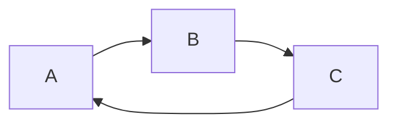

 Test Atom editor
## Gantt

```mermaid
gantt
    title FHP-41 制御プログラム 作成進捗表

    section FHP-41
    冷却プレート 動作プログラム: done, a1, 2017-07-07, 5d
    製品搬送部 改造: done, a2, 2017-07-07, 4d
    搬送テスト:done, a3, after a2, 2d
    データリンク:done, a3, 2d
    section FHPL-10
    動作テスト & バッファ:2d
```

## Flow A


## Flow B


## Math
$f(x) = cos(x)$
